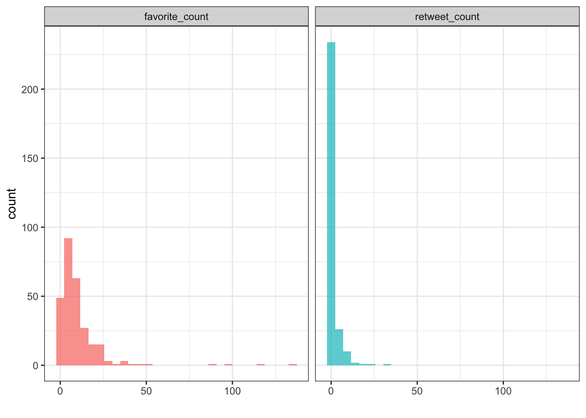

2021-11-26

<!-- README.md is generated from README.Rmd. Please edit that file -->

# twitter-stats

<!-- badges: start -->
<!-- badges: end -->

Having fun playing with Twitter data.

``` r
library(here)
library(tidyverse)
library(rtweet)
```

``` r
keys_dir <- '.keys/'
key_files <- list.files(here(keys_dir))
keys <- vector(mode = 'character', length = length(key_files))
names(keys) <- key_files
for (f in key_files) {
    keys[f] <- read_file(here(keys_dir, f)) 
}
```

``` r
# this requires Elevated access to the Twitter API
auth_as(rtweet_bot(
  api_key = keys[['API_Key']],
  api_secret = keys[['API_Key_Secret']],
  access_token = keys[["Access_Token"]],
  access_secret = keys[['Access_Token_Secret']]
))
# instead do this
auth_setup_default()
```

``` r
my_username <- 'kelly_sovacool'
me <- lookup_users(my_username)
num_tweets <- me[['statuses_count']]
#my_tweets_all <- get_timeline(user = me[['id']], n = num_tweets, retryonratelimit = TRUE) # Error: $ operator is invalid for atomic vectors 
my_tweets <- get_timeline(user = me[['id']], n = 1000)
my_tweets_orig <- my_tweets %>% filter(!startsWith(text, 'RT @')) # no retweets
```

``` r
my_tweets_orig %>% 
    filter(is.na(in_reply_to_status_id)) %>% 
    pivot_longer(c(favorite_count, retweet_count),
                 names_to = 'engagement_type',
                 values_to = 'engagement_count') %>% 
    ggplot(aes(engagement_count, fill = engagement_type)) +
    geom_histogram(alpha = 0.7) +
    facet_wrap('engagement_type', nrow = 1, scales = 'free') +
    labs(x = '') +
    theme_bw() +
    theme(legend.position = 'none')
#> `stat_bin()` using `bins = 30`. Pick better value with `binwidth`.
```

<!-- -->

## most liked tweets

``` r
most_liked <- my_tweets_orig %>% 
    slice_max(favorite_count, n = 5)
embeds <- 
    sapply(most_liked %>% pull('id_str'), 
           function(x) { cat(tweet_embed(screen_name = my_username, 
                                     status_id = x))
               })
```

<blockquote class="twitter-tweet">
<p lang="en" dir="ltr">
recently a prof was trying to be supportive telling me, "you'll publish
in Cell/Nature/Science one day, you will 😊"<br><br>y'all shoulda seen
his look of bewilderment when I replied "lol no I'll never submit a
manuscript to a for-profit closed-access journal as long as I have any
say"
</p>
— Kelly Sovacool (@kelly_sovacool)
<a href="https://twitter.com/kelly_sovacool/status/1463241171946414084?ref_src=twsrc%5Etfw">November
23, 2021</a>
</blockquote>
<script async src="https://platform.twitter.com/widgets.js" charset="utf-8"></script>
<blockquote class="twitter-tweet">
<p lang="en" dir="ltr">
I passed my prelim exam!!! I'm about to be a PhD candidate!
</p>
— Kelly Sovacool (@kelly_sovacool)
<a href="https://twitter.com/kelly_sovacool/status/1295427338616950784?ref_src=twsrc%5Etfw">August
17, 2020</a>
</blockquote>
<script async src="https://platform.twitter.com/widgets.js" charset="utf-8"></script>
<blockquote class="twitter-tweet">
<p lang="en" dir="ltr">
numpy seems to be doing a great job of ensuring that no women or other
underrepresented folks will want to contribute
</p>
— Kelly Sovacool (@kelly_sovacool)
<a href="https://twitter.com/kelly_sovacool/status/1309171854591045633?ref_src=twsrc%5Etfw">September
24, 2020</a>
</blockquote>
<script async src="https://platform.twitter.com/widgets.js" charset="utf-8"></script>
<blockquote class="twitter-tweet">
<p lang="en" dir="ltr">
YES! If that drunk-with-power feeling starts to fade, you can put your
plots in R Markdown documents and RULE THE WORLD — I mean uhh, make
reproducible reports!
</p>
— Kelly Sovacool (@kelly_sovacool)
<a href="https://twitter.com/kelly_sovacool/status/1330508574737502210?ref_src=twsrc%5Etfw">November
22, 2020</a>
</blockquote>
<script async src="https://platform.twitter.com/widgets.js" charset="utf-8"></script>
<blockquote class="twitter-tweet">
<p lang="en" dir="ltr">
another good one
<a href="https://t.co/djZGOlGD4L">https://t.co/djZGOlGD4L</a>
</p>
— Kelly Sovacool (@kelly_sovacool)
<a href="https://twitter.com/kelly_sovacool/status/1299138935105433601?ref_src=twsrc%5Etfw">August
28, 2020</a>
</blockquote>
<script async src="https://platform.twitter.com/widgets.js" charset="utf-8"></script>

## most retweeted tweets

``` r
most_rtd <- my_tweets_orig %>% 
    slice_max(retweet_count, n = 5)
embeds <- 
    sapply(most_rtd %>% pull('id_str'), 
           function(x) { cat(tweet_embed(screen_name = my_username, 
                                     status_id = x))
               })
```

<blockquote class="twitter-tweet">
<p lang="en" dir="ltr">
THIS 👇🏻 <a href="https://t.co/aPEh54zPFQ">https://t.co/aPEh54zPFQ</a>
<a href="https://t.co/pItMjNBrCx">pic.twitter.com/pItMjNBrCx</a>
</p>
— Kelly Sovacool (@kelly_sovacool)
<a href="https://twitter.com/kelly_sovacool/status/1303021425398181889?ref_src=twsrc%5Etfw">September
7, 2020</a>
</blockquote>
<script async src="https://platform.twitter.com/widgets.js" charset="utf-8"></script>
<blockquote class="twitter-tweet">
<p lang="en" dir="ltr">
Hey UMich folks! The next
<a href="https://twitter.com/hashtag/SoftwareCarpentry?src=hash&amp;ref_src=twsrc%5Etfw">#SoftwareCarpentry</a>
workshop is coming up on Sept 5 & 6! It covers the unix shell, version
control with
<a href="https://twitter.com/hashtag/git?src=hash&amp;ref_src=twsrc%5Etfw">#git</a>,
and programming in
<a href="https://twitter.com/hashtag/rstats?src=hash&amp;ref_src=twsrc%5Etfw">#rstats</a>.
Sign up ASAP if you're interested:
<a href="https://t.co/13UioFKcDl">https://t.co/13UioFKcDl</a>
</p>
— Kelly Sovacool (@kelly_sovacool)
<a href="https://twitter.com/kelly_sovacool/status/1165278560803794945?ref_src=twsrc%5Etfw">August
24, 2019</a>
</blockquote>
<script async src="https://platform.twitter.com/widgets.js" charset="utf-8"></script>
<blockquote class="twitter-tweet">
<p lang="en" dir="ltr">
<a href="https://twitter.com/hashtag/BlackInMicro?src=hash&amp;ref_src=twsrc%5Etfw">#BlackInMicro</a>
week is coming
up!<a href="https://twitter.com/dr_kozik?ref_src=twsrc%5Etfw">@dr_kozik</a>
&
<a href="https://twitter.com/KYT_ThatsME?ref_src=twsrc%5Etfw">@KYT_ThatsME</a>
are doing an awesome job organizing this:
<a href="https://t.co/lQ0865WqmG">https://t.co/lQ0865WqmG</a>
</p>
— Kelly Sovacool (@kelly_sovacool)
<a href="https://twitter.com/kelly_sovacool/status/1304143884482535425?ref_src=twsrc%5Etfw">September
10, 2020</a>
</blockquote>
<script async src="https://platform.twitter.com/widgets.js" charset="utf-8"></script>
<blockquote class="twitter-tweet">
<p lang="en" dir="ltr">
Hey UMich people! I'm a co-host for CoderSpaces, a free virtual office
hour where you can get help on coding/programming for your research
projects! Our hosts are eager to help with expertise in R, Python, C++,
Make, Snakemake, git/GitHub, HPC, & more:
<a href="https://t.co/B7tbG5urlr">https://t.co/B7tbG5urlr</a>
<a href="https://t.co/u0T7NGJY8F">pic.twitter.com/u0T7NGJY8F</a>
</p>
— Kelly Sovacool (@kelly_sovacool)
<a href="https://twitter.com/kelly_sovacool/status/1435984568377561089?ref_src=twsrc%5Etfw">September
9, 2021</a>
</blockquote>
<script async src="https://platform.twitter.com/widgets.js" charset="utf-8"></script>
<blockquote class="twitter-tweet">
<p lang="en" dir="ltr">
We have a lot of contacts in academia and would especially love to have
some more guest speakers from industry & other career paths! Any tech or
data science adjacent
field!<a href="https://twitter.com/hashtag/GirlsWhoCode?src=hash&amp;ref_src=twsrc%5Etfw">#GirlsWhoCode</a>
<a href="https://twitter.com/hashtag/WomenWhoCode?src=hash&amp;ref_src=twsrc%5Etfw">#WomenWhoCode</a>
<a href="https://twitter.com/hashtag/DataScience?src=hash&amp;ref_src=twsrc%5Etfw">#DataScience</a>
<a href="https://t.co/ef13XRVAei">https://t.co/ef13XRVAei</a>
</p>
— Kelly Sovacool (@kelly_sovacool)
<a href="https://twitter.com/kelly_sovacool/status/1393946887737200643?ref_src=twsrc%5Etfw">May
16, 2021</a>
</blockquote>
<script async src="https://platform.twitter.com/widgets.js" charset="utf-8"></script>
<blockquote class="twitter-tweet">
<p lang="en" dir="ltr">
We heard some of our fellow grad students say they'd like to learn how
to code now that they can't do bench work with labs closed due to
<a href="https://twitter.com/hashtag/COVID19?src=hash&amp;ref_src=twsrc%5Etfw">#COVID19</a>.
We thought we could help with this short guide on teaching yourself how
to code:<a href="https://t.co/MxgHX4Rr0O">https://t.co/MxgHX4Rr0O</a>
</p>
— Kelly Sovacool (@kelly_sovacool)
<a href="https://twitter.com/kelly_sovacool/status/1241141643887038464?ref_src=twsrc%5Etfw">March
20, 2020</a>
</blockquote>
<script async src="https://platform.twitter.com/widgets.js" charset="utf-8"></script>
<blockquote class="twitter-tweet">
<p lang="en" dir="ltr">
It can get confusing to figure out which coding-related orgs you might
be interested in, so we made a flow chart to help!<br><br>🛠 Software
Carpentry:
<a href="https://t.co/TDZfpwafO8">https://t.co/TDZfpwafO8</a><br>📊 Data
Analysis Networking Group:
<a href="https://t.co/GsEtnmei4e">https://t.co/GsEtnmei4e</a><br>👩🏽‍💻
Girls Who Code @ DCMB:
<a href="https://t.co/B3CoESRj4H">https://t.co/B3CoESRj4H</a>
<a href="https://t.co/VpVRb3yYB9">pic.twitter.com/VpVRb3yYB9</a>
</p>
— Kelly Sovacool (@kelly_sovacool)
<a href="https://twitter.com/kelly_sovacool/status/1221146641853448194?ref_src=twsrc%5Etfw">January
25, 2020</a>
</blockquote>
<script async src="https://platform.twitter.com/widgets.js" charset="utf-8"></script>
